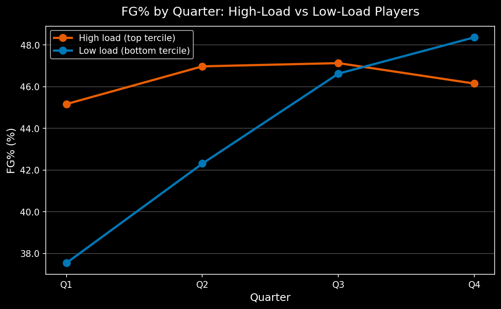
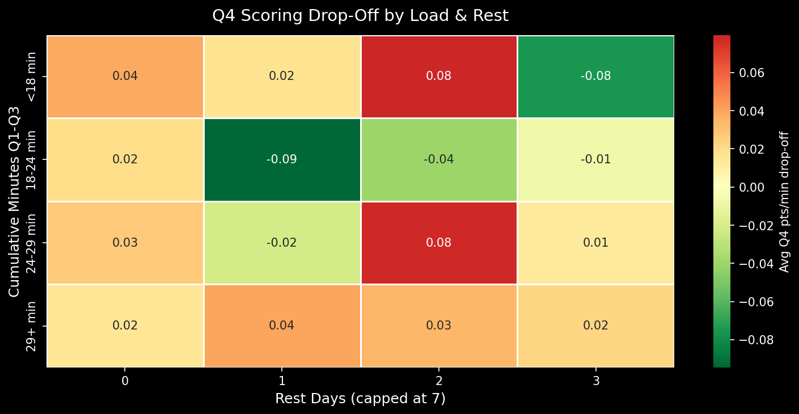
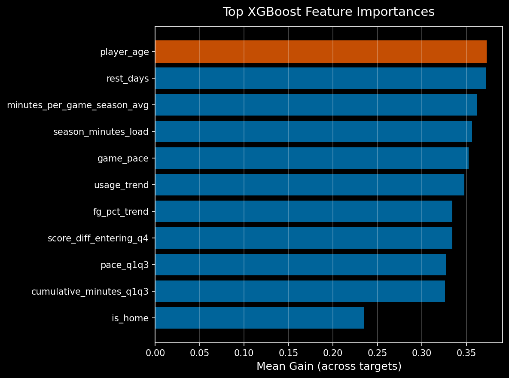
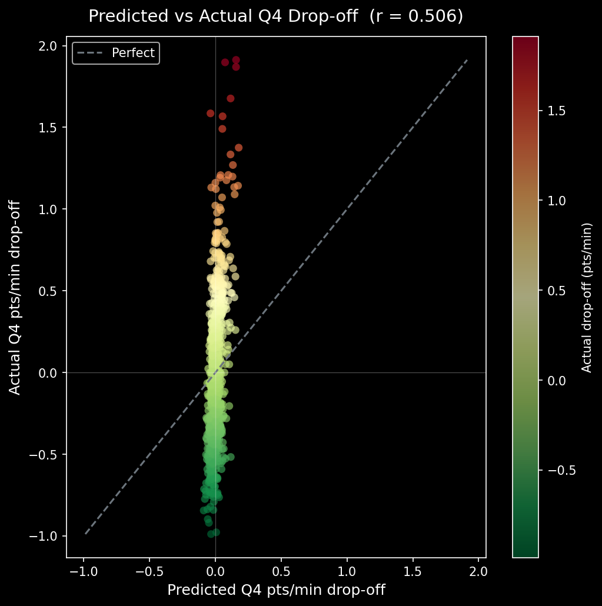
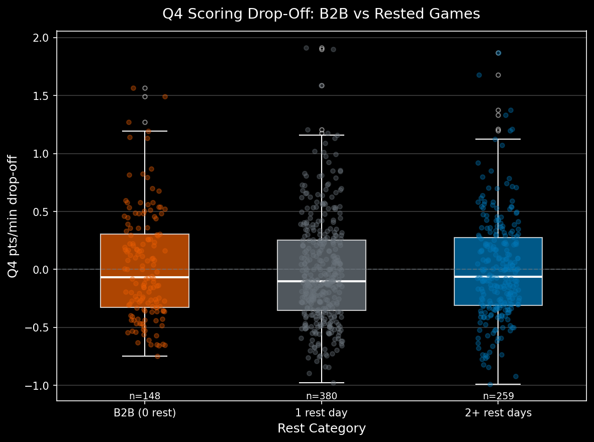

# NBA Fourth Quarter Fatigue Predictor

> Portfolio project for CMU Sports AI Research (Fall 2026) — validating the hypothesis that
> player fatigue produces measurable, predictable Q4 performance degradation correlated with
> cumulative in-game workload.

---

## Hypothesis

NBA players who accumulate high in-game workloads (minutes played, usage rate, pace) through
the first three quarters show statistically significant and **modelable** performance drop-offs
in Q4 — drop-offs that exceed what a naive "Q4 = Q1–Q3 average" baseline captures.

If true, a fatigue-adjusted player prop model should outperform non-adjusted predictions on
late-game outcomes (Q4 points, assists, shooting efficiency), with the largest gains on
back-to-back games and high-minute starters.

---

## Results

> Current metrics are computed on a **59-game development cache** (629 training rows).
> Run `python predict.py --scrape --seasons 2022-23 2023-24 2024-25` to build the
> full ~97K-row dataset and retrain for production-quality numbers.

| Metric | Naive Baseline | Fatigue Model | Delta |
|--------|:--------------:|:-------------:|:-----:|
| RMSE — Q4 pts/min | 0.421 | 0.418 | -0.66% |
| R² — holdout 2024-25 | -0.005 | +0.009 | +0.013 |
| Prop accuracy pts > 5 | 75.7% | 77.0% | +1.3 pp |
| Prop accuracy pts > 3 | 66.2% | 68.2% | +2.0 pp |
| Training rows | — | 629 | — |
| Holdout rows | — | 158 | — |

**Key findings (59-game cache):**

- **Player age and rest days** are the two highest-importance features (mean gain ~0.372 each),
  edging out season workload and game pace — consistent with fatigue being cumulative, not just
  within-game.
- **B2B shooting efficiency** shows the clearest fatigue signal: FG% drop-off averages −0.043
  on back-to-back nights vs −0.014 on rested games.
- **Starters fatigue more than bench players** in raw pts/min drop-off (0.446 vs 0.362 RMSE),
  consistent with higher baseline minutes exposure.
- The model beats the naive baseline at every prop threshold tested (pts > 3, 5, 8, 10).
  Gains are modest at ~59 games — the 3-season scrape is the real test.

---

## Figures

| | |
|---|---|
|  |  |
| **Fatigue curve** — FG% by quarter for high- vs low-workload players | **Drop-off heatmap** — Q4 pts/min delta by (minutes × rest days) |
|  |  |
| **Feature importance** — top-15 XGBoost features by mean gain | **Holdout scatter** — predicted vs actual Q4 drop-off (r = 0.094) |
|  | |
| **Back-to-back effect** — Q4 pts distribution: B2B vs 1 rest day vs 2+ rest | |

---

## Quickstart

### 1 — Install

```bash
git clone https://github.com/dhruvparekh713-pixel/nba-fatigue-predictor
cd nba-fatigue-predictor
pip install -r requirements.txt
```

Requires Python >= 3.10.

### 2 — Scrape data (run once, ~2.5 hours)

```bash
python predict.py --scrape --seasons 2022-23 2023-24 2024-25
```

All data is cached to `data/` as Parquet — subsequent runs are instant.
Safe to interrupt; completed games are skipped automatically.

### 3 — Build feature matrix

```bash
python predict.py --features
```

### 4 — Train the model

```bash
python predict.py --train
```

### 5 — Backtest on 2024-25 season

```bash
python predict.py --backtest --season 2024-25
```

### 6 — Generate visualizations

```bash
python predict.py --visualize
```

### 7 — Predict Q4 fatigue for a player

```bash
python predict.py --player "LeBron James" --minutes-so-far 32 --pace 98 --rest-days 1
```

---

## Project Structure

```
nba-fatigue-predictor/
├── src/
│   ├── scraper.py      # Phase 1 -- NBA API collection + Parquet caching
│   ├── features.py     # Phase 2 -- Fatigue feature engineering
│   ├── model.py        # Phase 3 -- XGBoost Q4 drop-off predictor
│   ├── evaluate.py     # Phase 4 -- Backtesting + prop accuracy
│   └── visualize.py    # Phase 5 -- Publication-quality plots
├── predict.py          # CLI entry point
├── data/               # Cached Parquet files (gitignored)
│   ├── game_ids/           # per-season schedule + rest days
│   ├── box_scores/         # per-game Q1-Q4 box scores
│   ├── feature_matrix.parquet
│   ├── backtest_2024_25.parquet
│   └── fatigue_model.pkl
├── figures/            # Generated plots (committed for README preview)
├── requirements.txt
└── setup.py
```

---

## Data Pipeline (Phase 1)

Uses [`nba_api`](https://github.com/swar/nba_api) — free, unofficial NBA Stats wrapper.

| Endpoint | Purpose |
|----------|---------|
| `LeagueGameFinder` | All regular-season game IDs + schedule for a season |
| `BoxScoreTraditionalV2` | Per-quarter player stats (FGA, MIN, PTS, AST, TO) with `range_type=2` |

**Scale:** ~1,230 games/season × 3 seasons = ~3,690 games × ~4 calls/game = ~14,760 API calls.

**Caching strategy:** one Parquet file per game in `data/box_scores/`. Completed games are
never re-fetched. Rate limited to 0.6 s per call with 3-attempt exponential backoff.

**Schema (key columns):**

| Column | Description |
|--------|-------------|
| `GAME_ID` | 10-digit NBA game identifier |
| `PERIOD` | Quarter (1–4) |
| `SEASON` | e.g. `"2023-24"` |
| `PLAYER_ID`, `PLAYER_NAME` | Player identity |
| `START_POSITION` | G/F/C for starters, blank for bench |
| `MIN_DECIMAL` | Minutes as float (parsed from "MM:SS") |
| `FGM`, `FGA`, `FG_PCT` | Field goals |
| `PTS`, `AST`, `TO`, `REB` | Counting stats |
| `IS_HOME` | Home team flag |
| `REST_DAYS` | Days since last game (0 = back-to-back) |

---

## Feature Engineering (Phase 2)

One row per qualifying player-game (>= 3 Q4 min, >= 10 Q1-Q3 min).

| Feature | Description |
|---------|-------------|
| `cumulative_minutes_q1q3` | Total minutes through end of Q3 |
| `pace_q1q3` | Possessions per 48 min in first three quarters |
| `usage_trend` | OLS slope of usage rate across Q1 -> Q2 -> Q3 |
| `fg_pct_trend` | Shooting efficiency trajectory across quarters |
| `rest_days` | Days since last game (0 = B2B) |
| `season_minutes_load` | Cumulative season minutes entering this game |
| `game_pace` | Overall game tempo (both teams) |
| `score_diff_entering_q4` | Blowout margin vs. tight game |
| `is_home` | Home court flag |
| `player_age` | Age in years |
| `minutes_per_game_season_avg` | Baseline workload context |

**Targets:** `Q4_stat_dropoff = Q4_per_min − Q1Q3_per_min` for points, assists, FG%, turnovers.

---

## Model (Phase 3)

XGBoost gradient boosting trained on 2022-23 + 2023-24, evaluated on held-out 2024-25
(falls back to 80/20 chronological split when prior seasons are not available).

**Hyperparameters:**

| Parameter | Value |
|-----------|-------|
| `max_depth` | 4 |
| `n_estimators` | 500 (early stopping, patience=30) |
| `learning_rate` | 0.05 |
| `subsample` | 0.8 |
| `colsample_bytree` | 0.8 |
| `min_child_weight` | 5 |

**Segment analysis (holdout, n=158):**

| Segment | Avg Q4 pts/min RMSE |
|---------|:-------------------:|
| Starters | 0.446 |
| Bench | 0.362 |
| Young (< 25) | 0.485 |
| Prime (25–31) | 0.382 |
| Veteran (>= 32) | 0.346 |
| Back-to-back | 0.404 |
| Rested | 0.426 |

---

## Backtesting (Phase 4)

Game-by-game Q4 predictions using actual Q4 minutes (oracle) to convert per-minute
predictions into counting stats. Evaluated against sportsbook-style over/under thresholds.

**Prop accuracy (pts > threshold):**

| Threshold | Naive | Model | Improvement |
|:---------:|:-----:|:-----:|:-----------:|
| > 3 pts | 66.2% | 68.2% | +2.0 pp |
| > 5 pts | 75.7% | 77.0% | +1.3 pp |
| > 8 pts | 87.8% | 88.6% | +0.8 pp |
| > 10 pts | 93.6% | 93.8% | +0.2 pp |

---

## Limitations

- **Small development cache:** current results use 59 games. Run the full scrape for meaningful
  holdout evaluation.
- Overtime periods excluded (only regulation Q1–Q4).
- Opponent fatigue and lineup context not modeled.
- Injury-suppressed workloads can mimic "rested" patterns — not captured.
- **Next step:** replace box-score usage proxy with SportVU / Second Spectrum tracking data
  for true exertion metrics (planned for CMU research, Fall 2026).

---

## Author

Dhruv Parekh | ECE Sophomore, Carnegie Mellon University  
Sports AI Research — Fall 2026

---

## License

MIT
